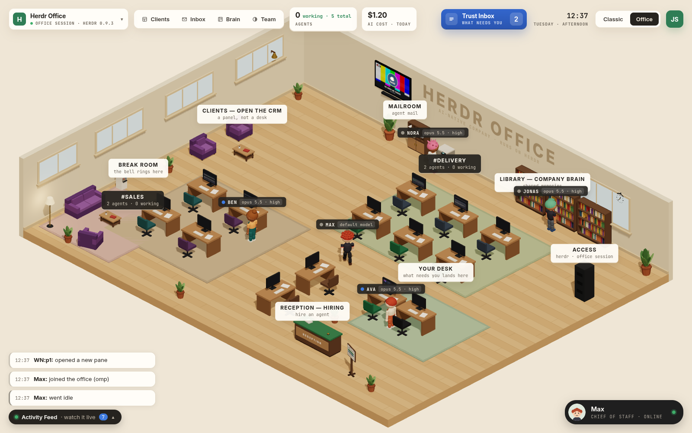

# Dunder

Dunder is a desktop app that puts your AI coding agents in a 3D isometric office. Each agent (omp, Claude Code or Codex) gets a desk whose monitor shows its live terminal; agents walk to the mailroom, the library and the break room, talk to each other in speech bubbles, and pile up what needs you in a Trust Inbox. Click any monitor to take over that terminal.

Under the hood every agent runs in [herdr](https://herdr.dev), the terminal multiplexer, inside a dedicated herdr session called `office`. Dunder only reads and drives that session, so your other herdr sessions stay untouched. Lay out rooms, desks and decor yourself, run several companies side by side, and hire or let go of agents from reception.

The Team panel keeps **Open screen** on each card; use the ⋯ menu for Beads, Open in editor, Switch model and Interrupt with its confirmation.



## Install

```sh
curl -fsSL https://dunder.yougotserved.dev/install.sh | sh
```

or, with Node.js installed:

```sh
npx dunder-ai
```

Full install docs: <https://dunder.yougotserved.dev>.

### Requirements

- Linux x64
- [herdr](https://herdr.dev), the terminal multiplexer the office runs on
- [omp](https://omp.sh), the default agent harness (Claude Code and Codex work too)

The installer checks for herdr and omp and installs whatever is missing.

## Develop

```sh
npm install
npm run dev      # dev server with hot reload
npm run office   # production build, supervised: survives edits, relaunches on update
npm run check    # typecheck, lint and unit tests
npm run scene:shot     # headless screenshot of the 3D scene (no Electron, stubbed IPC) + side-by-side vs the reference
npm run scene:profile  # the same stubbed scene served at http://localhost:5179/profile.html with a frame probe
```

`scene:shot` serves `scripts/scene-shot/page` with Vite and renders it in headless Chrome (a system Chrome/Chromium, Playwright's cached headless shell, or `$SCENE_SHOT_CHROME`). It writes `docs/screenshots/m5-office.png`, `docs/screenshots/m5-vs-reference.png` and `docs/screenshots/characters-lineup.png` (every crew member plus each hairstyle, face part, accessory, outfit and headwear, under the office's lights and camera angle, at overview zoom and in close-up). Use it instead of a second app instance, which would start its own workforce on the live `office` session.

`scene:profile` serves the same page for a browser you drive yourself; `window.__probe.measure(ms)` reports frame time, R3F loop CPU time, draw calls and WebGL calls per frame, `window.__probe.sceneStats()` mesh and shadow-caster counts per scene child. The scene shots show sample sticky notes (queued mail) on a few desks; the profiler leaves them off unless its URL has `?notes`.

## Architecture

[docs/BRIEF.md](docs/BRIEF.md) is the product brief and the source of truth: how the app maps onto herdr, the rules for the `office` session, the 3D scene and the terminal streams. In short:

- `src/main`: the Electron main process: the herdr bridge, terminal streams, the workforce supervisor and app state on disk.
- `src/renderer`: the React Three Fiber office and its HUD; it talks to main over IPC only.
- `src/shared`: zod schemas and pure logic used by both sides.
- `src/cli` and `bin/`: small tools agents use from their shells, such as `office-say`.
- `docs/agents`: the protocol and role briefs given to every agent in the office.
